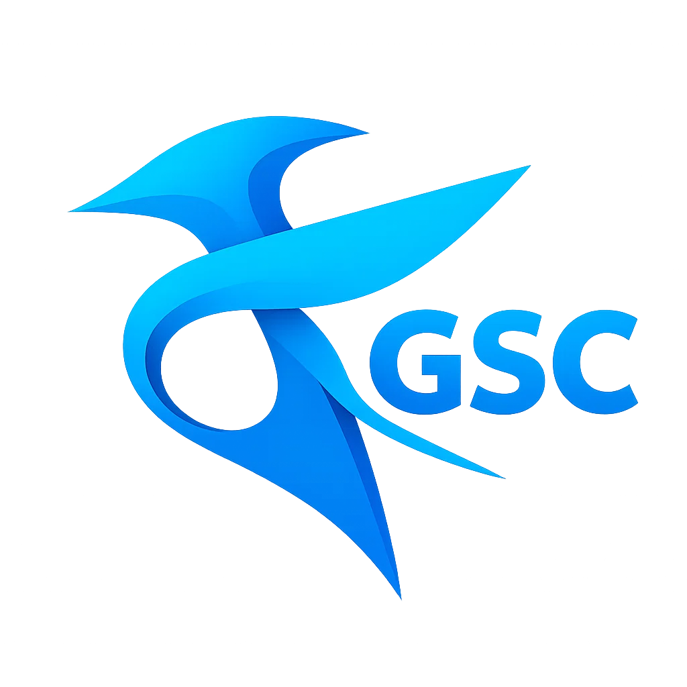

<meta property="og:image" content="kate-gsc.png" />

<p align="center"> <u>Free Palestine!</u> </p>

# kate-gsc 
Kate is an awesome, feature-full code editor. Being native, it's way more responsive than electron-based VS Code.
This repo contains info on how to configure kate for CoD GSC.

## Instructions

If you're reading from GitHub, goto https://coyoteclan.github.io/kate-gsc/

### Highlighting

- Click one of the Download buttons on top-right corner.
- Extract and Copy `gsc.xml` to:
    
    ```$HOME/.local/share/org.kde.syntax-highlighting/syntax/``` on linux
    
    ```%USERPROFILE%\AppData\Local\org.kde.syntax-highlighting\syntax``` on windows

- Open Kate
- Click Settings -> Configure Kate
- Goto Open/Save -> Modes & Filetypes
- Add a new filetype.
- Enter the following info in the fields:

| Field | Value |
| --- | --- |
| Name | ``CoD GSC`` (has to be exactly same) |
| Section | ``Scripts`` (has to be exactly same) |
| Variables | ``kate: auto-brackets true;`` |
| Highlighting | ``Scripts/CoD GSC`` |
| Indentation mode | ``C Style`` |
| File extensions | ``*.gsc`` |
| MIME types | ``text/x-gsc`` |
| Priority | ``15`` is pretty high |


### Language Server

*coming soon...*

## Notes
Logo generated by Sora. [Source](https://sora.chatgpt.com/g/gen_01jwwmj3xdfnpat13aj9tmen49)
